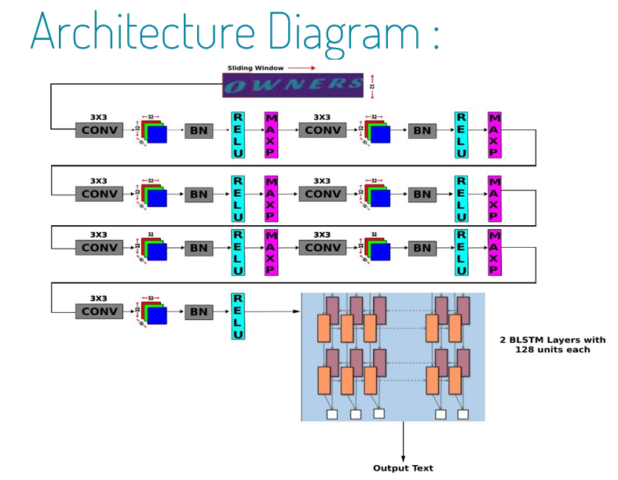
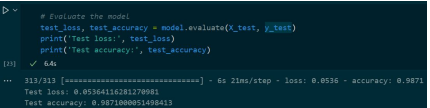
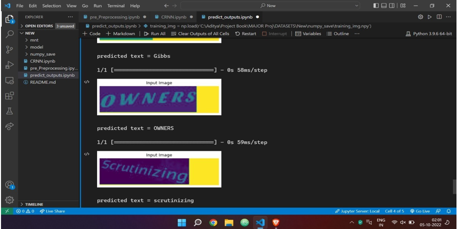
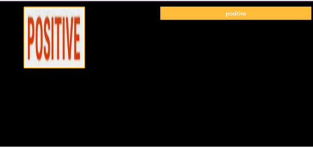

# Optical-Character-Recognition-OCR

OCR using Deep Learning.

## Overview

This repository contains the code for a deep learning project that implements Optical Character Recognition (OCR) using Convolutional Recurrent Neural Network (CRNN). The project includes a Flask-based frontend for easy interaction.

## Features

- **CRNN Model**: Utilizes a Convolutional Recurrent Neural Network for effective optical character recognition.
- **Flask Frontend**: Provides a user-friendly web interface for interacting with the OCR model.
- **Image Upload**: Allows users to upload images containing text for recognition.
- **Real-time Inference**: Demonstrates real-time character recognition on uploaded images.

## Project Structure

- Frontend

  - static

  - app.py (Flask File)

  - ocr.tflite (Model for Flask)

- Model

  - CRNN.ipynb (Model File)

  - pre_processing.ipynb (Pre Processing File)

- .gitignore

- requirements.txt

## Getting Started

1. Clone the repository:

   ```bash
   git clone https://github.com/your-username/ocr-crnn-flask.git
   cd ocr-crnn-flask
   ```

2. Install dependencies:

   ```bash
   pip install -r requirements.txt
   ```

3. Run the Flask app:

   ```bash
   python app.py
   ```

4. Open your browser and navigate to [http://localhost:5000](http://localhost:5000) to access the OCR application.

## Usage

1. Upload an image containing text through the web interface.
2. Click the "Recognize" button to initiate the OCR process.
3. View the results, including the recognized text.

## Dependencies

- Flask
- TensorFlow
- OpenCV
- Other dependencies listed in `requirements.txt`

## Implementation Visuals

1. Architecture Diagram

   

2. Model Accuracy

   

3. Model Predictions

   

4. Flask UI

   

## Publications

- [OCR using CRNN: A Deep Learning Approach for Text Recognition](https://ieeexplore.ieee.org/document/10170436)

## Citation

Please cite the following paper if you are using the code/model in your research paper.

    @INPROCEEDINGS{10170436,
    author={Yadav, Aditya and Singh, Shauryan and Siddique, Muzzamil and Mehta, Nileshkumar and Kotangale, Archana},
    booktitle={2023 4th International Conference for Emerging Technology (INCET)},
    title={OCR using CRNN: A Deep Learning Approach for Text Recognition},
    year={2023},
    volume={},
    number={},
    pages={1-6},
    doi={10.1109/INCET57972.2023.10170436}}

## License

This project is licensed under the MIT License - see the [LICENSE](LICENSE) file for details.
